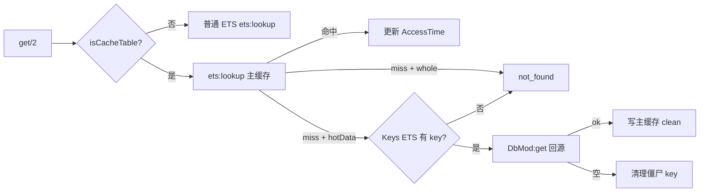
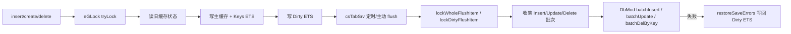
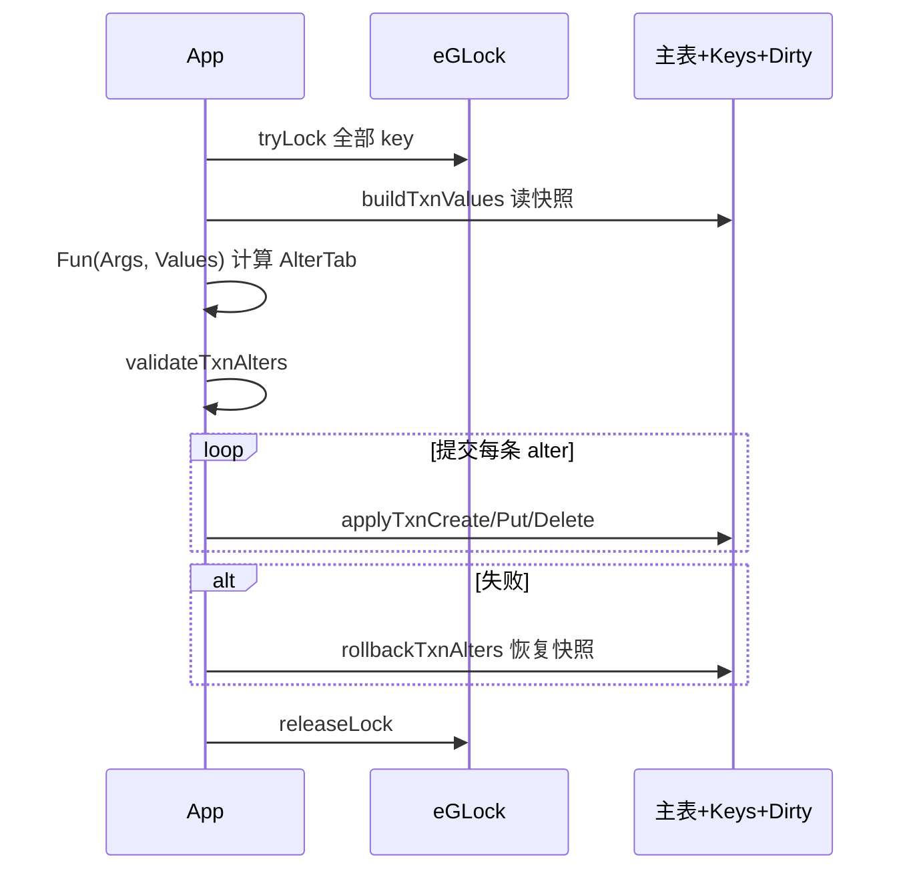

# eCas 设计说明

本文档描述 eCas 的核心架构、数据流与 `txn` 语义。以当前代码为准，主要参考 `src/eCas.erl`、`src/csTabSrv.erl`、`include/eCas.hrl`。

相关文档：

- [README.md](../README.md) — 使用手册与 API
- [batch-update-sql.md](batch-update-sql.md) — dirty 批量更新 SQL 生成

## 总体架构

eCas 在 Erlang 游戏服中提供「内存缓存 + 定时落盘」层：

```text
应用层
  └─ eCas.erl          CRUD / txn / flush / stats
       ├─ eGLock         {Table, Key} 粒度并发锁
       ├─ csTabSrv       每张缓存表一个 gen_server：加载、flush、TTL、reload
       └─ DbMod          eMysql / ePgdb（或测试替身 fake_db）
```

每张缓存表对应：

| 组件 | 作用 |
|------|------|
| 主 ETS `Table` | `{Key, Data, DirtyState, DirtyMask, AccessTime}` |
| Dirty ETS | `{Key, DirtyType}`，flush 扫描入口 |
| Keys ETS | hotData 专用，`{Key}` 表示 DB/逻辑层存在该 key |
| `csTabSrv` | 定时器触发 flush、TTL 淘汰、stats、reload |

缓存类型由 `cacheTabDef:tableCache/1` 决定：

- **whole**：启动全量加载主 ETS
- **hotData**：启动只加载 Keys ETS，数据按需 DB 回源
- **普通 ETS**：`cacheType = undefined`，eCas 只提供加锁读写

## 读取路径



要点：

- whole 表 miss 直接 `not_found`，不查 DB。
- hotData miss 时先看 Keys ETS；有 key 才 DB 回源并写入主缓存。
- 回源为空时会清理 Keys ETS 中的僵尸 key。

## 写入与落盘路径



写入语义：

- `create`：新业务行，`DirtyState = new`。
- `insert`：更新已有行，`DirtyState = update`（若原为 new 则保持 new）。
- `saveType = dirty` 时通过 `diffDirtyMask/5` 维护字段位掩码，flush 只写变化字段。

落盘流程（`csTabSrv:flushDirtyData/3`）：

1. 从 Dirty ETS 取最多 `flushLimit` 条 key。
2. 对每个 key 加 `eGLock`。
3. 从 Dirty ETS 删除本轮 key（乐观）。
4. 按 `DirtyType` 收集 insert / update / delete 批次。
5. 调用 `DbMod` 批量写库。
6. 失败项通过 `restoreSaveErrors` 合并回 Dirty ETS，下轮重试。

## txn 提交流程

`txn/3,4` 不直接调用 `eGLock:txn/4`，而是 eCas 自己管理缓存表提交与回滚：



### TxnKey 形态

```erlang
{Table, Key}
| {Table, Key, Default}
| {noneTab, Key}
| {noneTab, Key, Default}
```

### AlterTab 形态

```erlang
{{Table, Key}, Data}       %% put/update，key 必须在 TxnKeys 中锁定
| {{Table, Key}, new, Data} %% create，不要求 key 已存在
| {{Table, Key}, del}       %% delete，key 必须在 TxnKeys 中锁定
```

### 校验规则

允许：

- 同一 key 在 `AlterTab` 中出现多次，按顺序执行，后者覆盖前者。

拒绝：

- `put/delete` 使用了未在 `TxnKeys` 中锁定的 key。
- 缓存表 `Data` 主键与 `Key` 不一致。

### 错误返回

- 加锁超时：`{error, {lock_timeout, TxnKeys}}`
- 提交失败：`{error, Reason}`，并回滚已执行的 alter
- `Fun` 中 `throw` 的值原样返回，尚未进入提交阶段
- 其他异常：`{error, {txn_error, {Class, Reason, Stack}}}`

### 删除路径差异

| 路径 | whole 表行为 |
|------|-------------|
| `delete/2` | 对已落盘数据立即调用 `DbMod:delete/2` |
| `txn` 中 `del` | 写 Dirty ETS，延迟到 flush 落盘，可回滚 |

业务若需要 whole 删除参与事务，应使用 `txn` + `del`，不要直接调 `delete/2`。

## 缓存行与状态

主 ETS 统一格式：

```erlang
{Key, Data, DirtyState, DirtyMask, AccessTime}
```

| 字段 | 说明 |
|------|------|
| `DirtyState` | `clean` / `new` / `update` |
| `DirtyMask` | dirty 模式字段位掩码；whole 模式固定 0 |
| `AccessTime` | hotData TTL 淘汰用 |

Dirty ETS：`{Key, DirtyType}`，`DirtyType = new | update | del`。

## 启动流程

```text
eCas:start/7
    ├─ application:ensure_all_started(eCas)
    ├─ DbMod:start/6
    ├─ persistent_term:put(?csDbMod, DbMod)
    └─ startCsTables(getCaches(), ...)
         └─ eCas_sup:startTable/2
              └─ csTabSrv:init/1
                   ├─ createTabEts
                   ├─ maybeSaveTimer
                   ├─ maybeTtlTimer
                   └─ loadInitData
```

- `wFCnt` 控制每批启动表进程数，最小为 1。
- whole 表：`DbMod:foreachRows/4` 全量加载。
- hotData 表：只投影主键写入 Keys ETS。

## TTL 淘汰

仅 hotData 且 `ttl > 0` 时生效。淘汰条件：

- `AccessTime < Now - TTL`
- `DirtyState == clean`

只删主缓存行，不删 Keys ETS；下次读取仍可 DB 回源。

flush 成功落盘后，主缓存行的 `AccessTime` 会设为 `monotonic_time(second) + 3`，给落盘窗口留几秒缓冲，避免 TTL 扫描在 DB 写入完成前误淘汰刚变 clean 的行。

## 已知边界

- 单主键前提，无复合主键。
- 无持久化 dirty log，VM 崩溃可能丢未落盘数据。
- whole `delete/2` 与 txn `del` 的 DB 副作用时机不同（见上表）。
- `saveMode` 单位为毫秒。
- 普通 ETS 表由调用方创建并设置 `keypos`。
